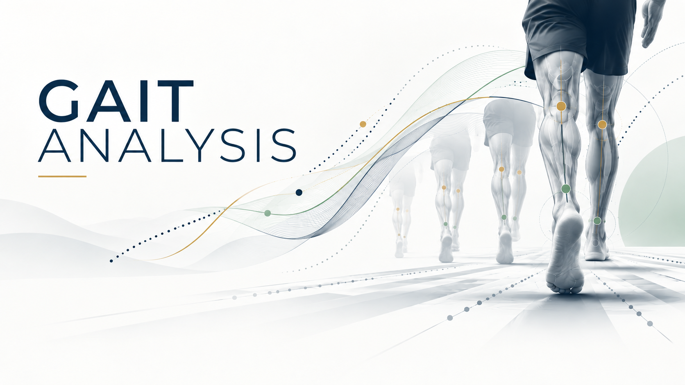

# 💡 Gait Analysis

<p align="center">
  
</p> 

A computer-vision system for estimating rearfoot motion from a short rear-view treadmill video recorded with a standard smartphone.

This project was developed as part of course 67547 - Engineering Project and Workshops II at the Hebrew University of Jerusalem.

## Table of Contents

- [The Team](#-the-team)
- [Project Description](#-project-description)
- [Getting Started](#-getting-started)
- [Prerequisites](#-prerequisites)
- [Installing](#️-installing)
- [Testing](#-testing)
- [Deployment](#-deployment)
- [Built With](#️-built-with)
- [Acknowledgments](#-acknowledgments)

## 👥 The Team

Team Members

- Yair Kramer
- Chaim Pasikov

Supervisor

- Nir Sweed

## 📚 Project Description

Running gait analysis can provide useful information about lower-limb mechanics and rearfoot motion, but detailed assessment usually requires specialized equipment and trained professionals.

This project develops a more accessible alternative based on a short rear-view treadmill video recorded using a standard smartphone.

The complete processing pipeline is:

1. A rear-view treadmill video is recorded using a standard smartphone.
2. The video is decoded and sampled into frames using OpenCV.
3. Each sampled frame is classified as contact or no-contact.
4. Contact frames are passed to a custom lower-limb keypoint model.
5. The model detects six points:
   - left knee
   - left ankle
   - left heel
   - right knee
   - right ankle
   - right heel
6. The stance leg is identified.
7. A two-dimensional rearfoot eversion angle is calculated from the knee-ankle-heel geometry.
8. Consecutive contact frames are grouped into stance events.
9. Measurements are aggregated across the video.
10. Quality checks are applied.
11. Results are displayed through a Streamlit web interface.

### Main Features

- Rear-view treadmill video analysis
- Contact / no-contact frame classification
- Six-point lower-limb keypoint detection
- Stance-leg identification
- 2D rearfoot eversion-angle estimation
- Stance-event grouping
- Quality-control warnings
- Streamlit-based user interface
- Saved analysis results and representative annotated frames

### Main Components

#### Contact Detection

A ResNet-based image classifier is used to classify sampled frames as contact or no-contact.

The classifier was trained on approximately 1,500 manually labeled rear-view running images and is deployed through Roboflow cloud inference.

Only frames classified as contact with sufficient confidence are passed to the keypoint-detection stage.

#### Keypoint Detection

Contact frames are analyzed using a custom RF-DETR keypoint model.

The model predicts six anatomical points:

- left knee
- left ankle
- left heel
- right knee
- right ankle
- right heel

RF-DETR is an existing detection-transformer architecture. For this project, we defined the six-keypoint representation, created and labeled the dataset, trained the model on rear-view running footage, and integrated its predictions into the gait-analysis pipeline.

#### Rearfoot Analysis

For the stance leg, the system constructs:

- a shank vector from the knee to the ankle
- a rearfoot vector from the ankle to the heel

The angle between these vectors is used as a two-dimensional estimate of rearfoot eversion.

Consecutive contact frames from the same leg are grouped into stance events, and event-level measurements are aggregated to reduce sensitivity to individual noisy frames.

### Dataset

The dataset was collected and labeled by the project team.

- 25 runners
- Approximately 1,500 contact / no-contact images
- Approximately 950 six-keypoint images
- Four unseen runner videos reserved for final evaluation

The videos were recorded from behind using standard smartphones while the runners were on a treadmill.

### Evaluation

The final system was evaluated on four unseen runner videos.

Contact detection:

- 115 predicted-contact frames reviewed
- 103 confirmed true-contact frames
- 12 false positives
- Precision: 89.6%

Keypoint localization:

| Keypoint | Mean Pixel Error | Mean Error (% of Shank Length) |
|---|---:|---:|
| Knee | 7.43 px | 3.06% |
| Ankle | 6.18 px | 2.88% |
| Heel | 11.68 px | 4.91% |
| Overall | 8.43 px | 3.62% |

A MediaPipe baseline was also evaluated:

- Usable detections: 22 / 103 contact frames
- Detection coverage: 21.4%
- Mean normalized localization error: approximately 39.6% of shank length

The custom RF-DETR keypoint model achieved a mean normalized error of 3.62% of shank length.

### Main Technologies

- Python
- OpenCV
- Roboflow
- RF-DETR
- ResNet
- Streamlit
- NumPy
- pandas
- python-dotenv

## ⚡ Getting Started

These instructions will give you a copy of the project up and running on your local machine for development and testing purposes.

### 🧱 Prerequisites

You will need:

- Python 3
- pip
- Git
- Internet connection
- Roboflow API key

The application was developed and tested on macOS.

A local GPU is not required because model inference is performed through Roboflow cloud inference.

### 🏗️ Installing

Clone the repository:

```bash
git clone https://github.com/chaimpasikov-ctrl/my-project.git
cd my-project
```

Create a Python virtual environment:

```bash
python3 -m venv .venv
```

Activate the environment:

```bash
source .venv/bin/activate
```

Install the required packages:

```bash
pip install -r requirements.txt
```

Create the environment configuration file:

```bash
cp .env.example .env
```

Add your Roboflow API key to `.env`:

```text
ROBOFLOW_API_KEY=your_api_key_here
```

Run the Streamlit application:

```bash
streamlit run app/ui/streamlit_app.py
```

Streamlit will provide a local URL that can be opened in a web browser.

The user can then upload a rear-view treadmill video and run the complete gait-analysis pipeline.

## 🧪 Testing

The project includes evaluation scripts for testing contact detection and lower-limb keypoint localization on unseen videos.

The main video-level evaluation script is:

```text
scripts/evaluate_on_video.py
```

The evaluation process includes:

- manually reviewing predicted contact frames
- identifying false-positive contact predictions
- manually marking knee, ankle, and heel ground-truth positions
- calculating Euclidean keypoint localization error
- normalizing localization error by shank length
- comparing the custom keypoint model with a MediaPipe baseline

The final evaluation was performed on four runner videos that were excluded from model training.

## 🚀 Deployment

The application currently runs locally using Streamlit.

Model inference is performed remotely through Roboflow, so running the application requires:

- Internet access
- a valid Roboflow API key
- the Python dependencies listed in `requirements.txt`

The current implementation is intended as an engineering prototype rather than a production deployment.

## ⚙️ Built With

- [Python](https://www.python.org/) - Main programming language
- [OpenCV](https://opencv.org/) - Video decoding and frame processing
- [Roboflow](https://roboflow.com/) - Dataset management, model training, workflows, and cloud inference
- [RF-DETR](https://rfdetr.roboflow.com/) - Lower-limb keypoint detection
- [Streamlit](https://streamlit.io/) - Web-based user interface
- [NumPy](https://numpy.org/) - Numerical processing
- [pandas](https://pandas.pydata.org/) - Data handling
- [python-dotenv](https://pypi.org/project/python-dotenv/) - Environment and API-key configuration

## 🙏 Acknowledgments

- Nir Sweed - Project advisor and mentor
- The Hebrew University of Jerusalem
- The Rachel and Selim Benin School of Computer Science and Engineering
- Course 67547 - Engineering Project and Workshops II
